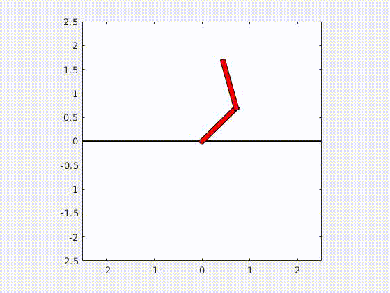

# Double Pendulum Demo

A simple example of using [Spatial v2](http://royfeatherstone.org/spatial/v2/) to model,
control, and simulate a double pendulum in Matlab.



## Install Instructions

Clone this repository: `git clone https://github.com/vincekurtz/double_pendulum_demo`

Get a copy of Spatial v2 if you haven't already. I recommend [this fork](https://github.com/vincekurtz/spatial_v2) which includes
a few minor fixes. 

Add Spatial v2 to the Matlab path, i.e., add the line
```
addpath(genpath('/path/to/spatial_v2'))
```
to `startup.m`. (Replace `/path/to` with the actual path to the `spatial_v2` folder on your system).

## Running the simulation

First run `generate_dynamics` if you haven't already. This runs the algorithms that compute
M(q), and other dynamics terms on symbolic variables and saves them as functions. You only
need to run `generate_dynamics` once: after that you should have autogenerated functions like
`MassMatrix.m` availible.

Run `simulate.m` to see a quick simulation of the double pendulum. 
